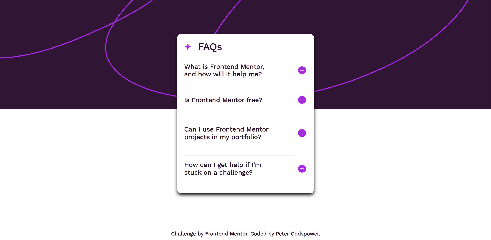
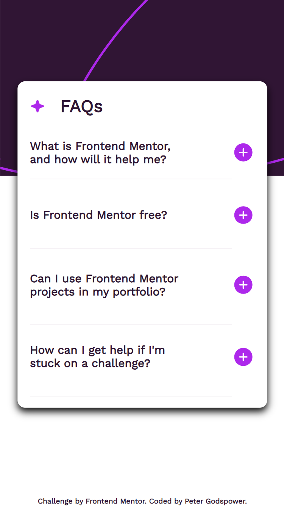

Certainly! Below is a sample `README.md` file written for the FAQ Accordion project based on the code you provided. This README includes an overview of the project, the technologies used, what was learned, and future development plans.

---

# Frontend Mentor | FAQ Accordion

This is a solution to the FAQ Accordion challenge on Frontend Mentor. The project involves creating an interactive FAQ accordion component where users can toggle answers to frequently asked questions with smooth transitions.

## Table of Contents

- [Overview](#overview)
  - [Screenshot](#screenshot)
  - [Links](#links)
- [My Process](#my-process)
  - [Built With](#built-with)
  - [What I Learned](#what-i-learned)
  - [Continued Development](#continued-development)
  - [Useful Resources](#useful-resources)
- [Author](#author)
- [Acknowledgments](#acknowledgments)

## Overview

### Screenshot

### Links

- Solution URL: [Frontend Mentor Solution](https://www.frontendmentor.io/solutions/faq-accordion)
- Live Site URL: [Live Demo](https://your-live-site-url.com) <!-- Update with actual URL -->

## My Process

I developed an interactive FAQ accordion component that allows users to expand and collapse answers to frequently asked questions. The component features a clean design with smooth transitions and responsive layout.

### Built With

- **Semantic HTML5 Markup:** Used modern HTML elements for structuring the FAQ component, enhancing readability and accessibility.
- **CSS Custom Properties:** Leveraged CSS variables for consistent styling and easy theming.
- **Flexbox:** Applied for layout and alignment, ensuring a responsive design across different screen sizes.
- **Responsive Design:** Utilized `clamp()` for fluid typography and media queries for adapting the layout to various devices.
- **JavaScript:** Managed user interactions and dynamic updates, including toggling FAQ answers and updating icons.

### What I Learned

This project improved my skills in:

- **CSS Transitions:** Implementing smooth animations for expanding and collapsing FAQ answers.
- **Responsive Design:** Applying CSS techniques to create adaptable layouts for different devices.
- **JavaScript Event Handling:** Managing user interactions and dynamic changes effectively.
- **Best Practices:** Structuring code for maintainability and performance.

### Continued Development

Future enhancements will focus on:

- **Advanced JavaScript Features:** Adding more interactive elements and refining data handling techniques.
- **CSS Animations:** Experimenting with advanced CSS animations for more engaging user experiences.
- **Accessibility Enhancements:** Ensuring the component is fully accessible to users with various needs and preferences.

### Useful Resources

- [MDN Web Docs](https://developer.mozilla.org/en-US/) - Comprehensive documentation for web development.
- [CSS-Tricks](https://css-tricks.com/) - Tutorials and articles on modern CSS techniques.
- [Frontend Mentor](https://www.frontendmentor.io/) - Platform for frontend challenges and community feedback.

## Author

- **Frontend Mentor:** [@YourProfile](https://www.frontendmentor.io/profile/YourProfile) <!-- Update with actual profile link -->
- **GitHub:** [YourGitHubUsername](https://github.com/YourGitHubUsername) <!-- Update with actual GitHub link -->

## Acknowledgments

Special thanks to Frontend Mentor for providing this engaging challenge and to the community for their valuable feedback and support.
